---
# You can also start simply with 'default'
theme: "slidev-theme-rockdove"
# random image from a curated Unsplash collection by Anthony
# like them? see https://unsplash.com/collections/94734566/slidev
# background: https://cover.sli.dev
# some information about your slides (markdown enabled)
title: Why am I being such a git about best practices?
info: |
  Are your git repos a dumping ground for code? I'm really fussy about how people use git - and that's a good thing. We'll take a look at branching strategies, the importance of commit messages and how often should you commit, anyway? Let's investigate how, with 5 simple tips, we can turn a code dump into a glorious archive of software and how this can save time, frustration and money.
# https://sli.dev/features/drawing
drawings:
  persist: false
# slide transition: https://sli.dev/guide/animations.html#slide-transitions
transition: view-transition
# enable MDC Syntax: https://sli.dev/features/mdc
mdc: true
# Icons:
#   - https://icones.js.org/collection/lucide-lab
#   - https://icones.js.org/collection/lucide
#   - https://icones.js.org/collection/logos

layout: intro
---

<style>
  .col-right {
    overflow: hidden;
  }

  .number {
    font-family: var(--font-family-code);
    background: var(--color-heading);
    color: var(--color-background);
    display: block;
    width: 1.2em;
    height: 1.2em;
    line-height: 1.2em;
    text-align: center;
    border-radius: 50%;
    font-size: 5rem;
  }

  small {
    color: var(--color-faint);
    font-size: 0.6em;
  }

  /* Colour the intro slides */
  :nth-child(7n + 1 of .slidev-page:has(.slidev-layout.intro)) {
    .slidev-layout {
      --color-background: var(--color-ming);
      --color-heading: var(--color-mandarin);
    }
  }
  :nth-child(7n + 2 of .slidev-page:has(.slidev-layout.intro)) {
    .slidev-layout {
      --color-background: var(--color-space-cadet);
      --color-heading: var(--color-mandarin);
      --color-text: white;
    }
  }
  :nth-child(7n + 3 of .slidev-page:has(.slidev-layout.intro)) {
    .slidev-layout {
      --color-background: var(--color-mandarin);
      --color-heading: var(--color-space-cadet);
    }
  }
  :nth-child(7n + 4 of .slidev-page:has(.slidev-layout.intro)) {
    .slidev-layout {
      --color-background: var(--color-minion-yellow);
      --color-heading: var(--color-dark-blue-gray);
    }
  }
  :nth-child(7n + 5 of .slidev-page:has(.slidev-layout.intro)) {
    .slidev-layout {
      --color-background: var(--color-bud-green);
      --color-heading: var(--color-minion-yellow);
    }
  }
  :nth-child(7n + 6 of .slidev-page:has(.slidev-layout.intro)) {
    .slidev-layout {
      --color-background: var(--color-carolina-blue);
      --color-heading: var(--color-space-cadet);
    }
  }
  :nth-child(7n + 7 of .slidev-page:has(.slidev-layout.intro)) {
    .slidev-layout {
      --color-background: var(--color-dark-blue-gray);
      --color-heading: var(--color-minion-yellow);
    }
  }

  .mermaid {
    display: flex;
    justify-content: center;
  }
</style>

<style scoped>
h1 {
  width: 90%;
  display: grid;
  grid-auto-rows: min-content; 
  grid-template-columns: auto auto auto;
  gap: 0 1ex;
  grid-auto-flow: row;
  align-items: end;

  strong:nth-child(1) {
    grid-area: auto / 2 / auto / 4;
  }
  strong:nth-child(2) {
    grid-area: auto / 2 / auto / auto;
  }
}
</style>

# Why am I being such a **git** about **best practices**?

---
layout: bio
image: /media/Unicorn-transparent.png
tagline: Senior Developer at Bump Digital
---

- <logos-mastodon-icon /> [@joe@umbraco&#8239;community.social](https://umbracocommunity.social/joe)
- <logos-bluesky />  [@joe.gl](https://bsky.app/profile/joe.gl)
- <lucide-globe /> https://joe.gl/ombek


---
layout: intro
---

# What is **git**?
<!--
- start really simple
- what is git?
- most popular Source Control Management (SCM) system. 
-->
---
layout: icons
---

- <lucide-database-backup /> Backup
- <lucide-package-open /> Versioning
- <lucide-hand-platter /> Sharability

<!--
It can ensure your code is

- backed up
- versioned
- accessible to other developers.
-->
---
layout: icons
---

- <lucide-rocket /> Release management
- <lucide-sparkles />Feature development
- <lucide-arrows-up-from-line /> Concurrent working

<!--
Used properly it can be so much more

- helping ease complex processes
  - release management
  - feature development
  - multiple people working concurrently
- I can be a bit of a git about it
- really fussy about how people use git
- that's a good thing
-->

---
layout: image
image: /media/evan-demicoli-HGCqL-tRcac-unsplash.jpg
---
<small>Photo by <a href="https://unsplash.com/@evandemicoli?utm_content=creditCopyText&utm_medium=referral&utm_source=unsplash">Evan Demicoli</a> on <a href="https://unsplash.com/photos/brown-and-green-houses-under-blue-sky-during-daytime-HGCqL-tRcac?utm_content=creditCopyText&utm_medium=referral&utm_source=unsplash">Unsplash</a></small>

<!--

- Worked with many organisations/dev teams over the years
- poor git utilisation is a more common issue than you might think. 

Dumping ground for code [Click] rather than an well-managed archive of software.
-->

---
layout: image
image: /media/ula-kuzma-9i4DHlC80AQ-unsplash.jpg
---
<small style="position:absolute; left:39%; top: 0;">Photo by <a href="https://unsplash.com/@ula_kuzma?utm_content=creditCopyText&utm_medium=referral&utm_source=unsplash">Ula Kuźma</a> on <a href="https://unsplash.com/photos/brown-pathway-between-white-organizers-9i4DHlC80AQ?utm_content=creditCopyText&utm_medium=referral&utm_source=unsplash">Unsplash</a></small>

<!--

- Worked with many organisations/dev teams over the years
- poor git utilisation is a more common issue than you might think. 

Dumping ground for code rather than an well-managed archive of software.
-->

---
layout: intro
---

# [5]{.number} simple tips to improve **git** usage

<!-- 
- 5 simple tips
- improve your git practice
-->

---
layout: intro
---

# [0]{.number} Source **Control yourselves**

<!--
- Not one of the 5
- some organisations out there not using version control yet [Click]

- SCM _not_ the same as a backup
- emailed some code to a colleague = doing it wrong!
- version control is essential for modern day software development
-->

---

<!-- <Tweet id="1432414619310739463" /> -->


<cite class="text-center"><logos-bluesky /> @louella.dev</cite>

<!--
- Not one of the 5
- some organisations out there not using version control yet

- SCM _not_ the same as a backup
- emailed some code to a colleague = doing it wrong!
- version control is essential for modern day software development
-->

---
layout: icons
---

<ul>
  <li v-mark="{ at: 1, type: 'crossed-off', color: 'var(--color-mandarin)', strokeWidth: 10 }"><logos-mercurial /> Mercurial</li>
  <li v-mark="{ at: 1, type: 'crossed-off', color: 'var(--color-mandarin)', strokeWidth: 10  }"><logos-subversion /> Subversion</li>
  <li v-mark="{ at: 1, type: 'crossed-off', color: 'var(--color-mandarin)', strokeWidth: 10  }"><logos-visual-studio /> Team Foundation Version Control</li>
  <li v-mark="{ at: 1, type: 'circle', color: 'var(--color-bud-green)', strokeWidth: 10, padding: 20 }"><logos-git-icon /> Git</li>
</ul>

<!--
- Mercurial (hg)
- Team Foundation Version Control (TFVC)
- Subversion (SVN)
- all examples of version control software [Click]
- Git taken over in the software world - industry standard
- Recommend it for that on its own
- no point teaching your team a version control system which is (or may become) redundant.
-->

---
layout: intro
---

# [1]{.number} Commit **Messaging is everything**

<!-- Tip number 1: Commit Messaging is everything -->

---
layout: center
---


https://xkcd.com/1296

<!--
 XKCD comic
 
 - "As a project drags on, my git commit messages get less and less informative"
 - as descriptive as "created main loop and timing control"
 - into "MY HANDS ARE TYPING WORDS" "HAAAAAANDS"
 - I'd like to say that was just a joke in a comic strip... [Click] ...but it can be all too real. I feel for you Dennis.-->


---
layout: center
---

{style='max-height:470px'}

https://x.com/dadolfi/status/1405424992121131010

<!--
 XKCD comic
 
 - "As a project drags on, my git commit messages get less and less informative"
 - as descriptive as "created main loop and timing control"
 - into "MY HANDS ARE TYPING WORDS" "HAAAAAANDS"
 - I'd like to say that was just a joke in a comic strip... ...but it can be all too real. I feel for you Dennis.-->

---
layout: two-cols
---

## Imagine being in Dennis' situation and...

<v-clicks>

- you've discovered a bug introduced in the latest version?
  Where do you even start to look for the solution?
- You see something odd in the codebase, there's no comment so you use a blame/annotate tool to see who changed it and why... but Andy is on holiday and his commit message says “test”
- Some piece of code has changed since you last saw it - why?
  You could revert it back to how you like it but maybe it was changed for a reason?
  You fire up the blame tool again, “Fixes date formatting issue in Chrome” - better leave it as it is!
  Saved by a good commit message!

</v-clicks>

::right::

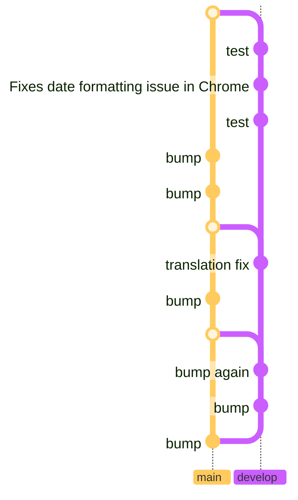

<!--
Imagine being in Dennis' situation and...


- [Click]you've discovered a bug introduced in the latest version?
  Where do you even start to look for the solution?
- [Click]You see something odd in the codebase, there's no comment so you use a blame/annotate tool to see who changed it and why... but Andy is on holiday and his commit message says “test”
- [Click]Some piece of code has changed since you last saw it - why?
  You could revert it back to how you like it but maybe it was changed for a reason?
  You fire up the blame tool again, “Fixes date formatting issue in Chrome” - better leave it as it is!
  Saved by a good commit message!

  -->

---
layout: icons-header
cols: 3
---

## "What does this commit do?"

::icons::

- <lucide-heart-pulse /> Fixes...
- <lucide-undo-dot /> Reverts...
- <lucide-lab-socket-uk /> Integrates...

<!--
- Answer "what does this commit do?"
- Start with a verb
  - "Fixes ..."
  - "Reverts ..."
  - "Integrates ..."
-->

---
layout: icons-header
cols: 3
---

## Not enough!

::icons::
<ul>
  <li v-mark="{ at: 1, type: 'crossed-off', color: 'var(--color-mandarin)', strokeWidth: 10 }"><lucide-heart-pulse /> Fixes bugs</li>
  <li v-mark="{ at: 1, type: 'crossed-off', color: 'var(--color-mandarin)', strokeWidth: 10 }"><lucide-undo-dot /> Reverts broken changes</li>
  <li v-mark="{ at: 1, type: 'crossed-off', color: 'var(--color-mandarin)', strokeWidth: 10 }"><lucide-lab-socket-uk /> Integrates API</li>
</ul>


<!--
- But these alone are not enough.
- "Fixes bugs" or "Reverts broken changes" [Click] are still useless. -->

---
layout: icons-header
cols: 3
---


## "What does this commit do?"

::icons::

- <lucide-heart-pulse /> **Fixes date formatting issue in Chrome**
  Chrome always assumes the MM/DD format no matter what locale the browser is set to*
- <lucide-undo-dot /> **Reverts new “Paytastic Checkout” checkout flow**
  Customer has changed their mind and wants to revert to using LegacyCart
- <lucide-lab-socket-uk /> **Integrates SMS API**
  Sending an SMS to customers when their order ships using the “Simple SMS Sender” API

<small>* it doesn't, this is a made up example</small>

<!--
- Detail, detail, detail!
- GitKraken (and others) give you two fields for your commit messages
- a title and a description
- Keep your title short (GitKraken recommends 72 characters)
- add even more detail in the description field
- Fixes date formatting issue in Chrome
  - Chrome always assumes the MM/DD format no matter what locale the browser is set to*
- Reverts new "Paytastic Checkout" checkout flow
  - Customer has changed their mind and wants to revert to using LegacyCart
- Integrates SMS API
  - Sending an SMS to customers when their order ships using the "Simple SMS Sender" API  -->

---
layout: center
class: invert
---

```cmd
git commit -m "Title" -m "Description"
```


```
Title⏎
⏎
Description
```
<!--
- CMD: two "message" parameters
- One field? Use line breaks
-->

---
layout: image-right
image: /media/link-to-issues.jpg
background-size: contain
---

## Link commits to issues

- Include the title of the issue/item
- Include an ID or link to the issue

GitKraken lets you hook up your issue tracker to your git repos so you can automatically stick an issue number into the branch name (and therefore in the merge commit too!)

  <!--
  - ticketing system or to-do list
  - include the title of the item in your commit
  - ID or link to the Initial issue
  - GitKraken (and others) let you hook up your issue tracker to your git repos
  - automatically stick an issue number into the branch name
  - in the merge commit too!

 -->

---
layout: intro
---

# [2]{.number} Get with the **flow**

<!-- Tip number 2 is to use a branching strategy. -->

---
layout: icons-header
cols: 4
---


## Flows

::icons::

- <lucide-git-branch /> Git Flow
- <logos-github-icon /> GitHub Flow
- <logos-gitlab /> GitLab Flow
- <lucide-git-branch /> Common Flow

::footer::
https://go.joe.gl/which-flow

<!-- 
- Many options
- I don't mind which - but use one!
- I 💗 GitHub flow and Common Flow (or a combination of the two)
- GitHub Flow and GitLab Flow aren't specific to hosts
- Any flow can be used anywhere
- Host may make it a bit easier to follow their flow on their host.

-->

---
layout: icons-header
cols: 5
---

<style scoped>
  /* ul {
    font-size: 0.8em;
  } */
</style>

## GitHub Flow

::icons::

- <lucide-git-branch />
  **Create a branch**
  with a short descriptive name
- <lucide-git-commit-vertical />
  **Add commits**
  Each commit as an isolated, complete change
- <lucide-git-pull-request-arrow />
  **Open a Pull Request**
  linked to an issue
- <lucide-message-circle-code />
  **Discuss and review**
  with the maintainer or a colleague
- <lucide-git-merge />
  **Merge**
  and delete your branch

::footer::

https://go.joe.gl/ghflow

<!-- TODO: longer version should have CommonFlow too -->

<!--
# GitHub flow

- create branch for feature
  - short descriptive name
- Add commits to that branch
  - commit containing "an isolated, complete change"
- Open Pull Request
  - Discuss / review code changes with colleagues
- Everyone is happy? Merge PR into `main`
- Main always deployable
- The GitHub flow tutorial goes into a little more detail

- None of these git flows make sense to you?
- take inspiration from them
- Rare to follow one particular strategy
- Pick one as a baseline and adapt it for your organisation

- GitHub Flow and GitLab Flow don't have to be restricted to GitHub or GitLab - you can use any flow anywhere
-->

---
layout: intro
---

# [3]{.number} Push **Little and often**

<!--
Tip number 3 is to commit and push little and often

- lot of different tactics when it comes to how often people commit
- most persuasive argument: "little and often"
- Don't forget git is backup

-->

---
layout: icons
---

- # <lucide-hard-drive />
- # <lucide-pill />
- # <lucide-lab-waves-shark-fin />
- # <lucide-bus-front />

<!-- 
- No point *only* committing when something is feature complete
- hard drive packs up overnight?
- off sick tomorrow and somebody else is left to pick up your work?
- More useful to have partially complete work committed than not.
- Generally good practice each commit is buildable
- Make exception for "WIP" commits
- In feature branches
 -->

---
layout: two-cols
---

## Reverting little things

You can also use your tiny commits to help you revert unwanted pieces of functionality, while it can be a real pain to pull small chunks of code out of a bigger commit.

Perhaps changing the colour-scheme to green text on a red background was a <i>bit</i> much...?

::right::

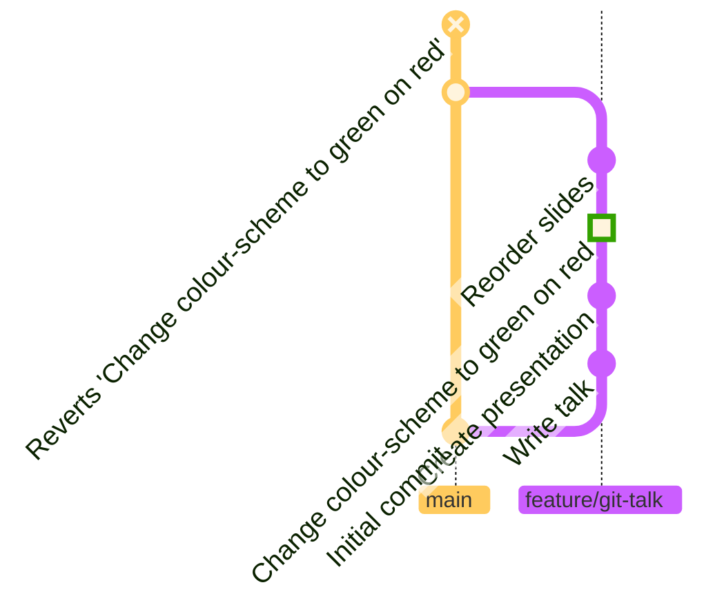

<!--
- tiny commits helpful when reverting
- hard to pull small chunks of code out of a bigger commit
- Changing the colour-scheme to green text on a red background was a bit much...?
-->

---
layout: intro
---

# [4]{.number} **Squash** rackets

<!--
- Don't "little and often" commits start to make a _racket_ after a while?
- (See what I did there?)
- That's where squash and amend come in. 
 -->

---
layout: two-cols-header
---

## Amend commits

::left::

<<< @/snippets/gitgraphs/wip-commit.mmd mermaid {scale: 0.75}

::right::


<!-- 
- Big fan of a WIP (Work -In-Progress) commit at the end of the day
- come tomorrow morning, finished that segment of work
- don't want two commits "WIP - Restyle footer" *and* "Restyle footer"
- Amend "WIP" commit to include all changes and rename it "Restyle footer"
-->

---
layout: two-cols-header
---

## Amend commits

::left::

<<< @/snippets/gitgraphs/wip-commit.mmd mermaid {scale: 0.75}

::right::

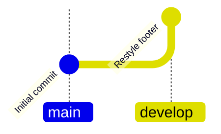


<!--
Leaving cleaner git graph
-->

---
layout: center
class: invert
---

```cmd
git commit --amend -m "Restyle footer"
```

https://atlassian.com/git/tutorials/rewriting-history

<!-- CMD: `git commit --amend -m "Restyle footer"`.

Atlassian tutorial [rewriting git history from the command line](https://www.atlassian.com/git/tutorials/rewriting-history).

-->

---
layout: two-cols-header
---

## Squash commits 

::left::

<<< @/snippets/gitgraphs/pre-squash.mmd mermaid {scale: 0.75}

::right::

{v-click}

<!--
- combine multiple commits
- or already committed your second round of changes
- "squashing" the commits. [Click]
- GitKraken:
  - select the commits you want to combine
  - right clicking
  - select "Squash"
- Scenarios when squashing won't be available - leave as-is! -->

---
layout: two-cols-header
---

## Squash commits 
What does it do!?

::left::

<<< @/snippets/gitgraphs/pre-squash.mmd mermaid {scale: 0.75}

::right::

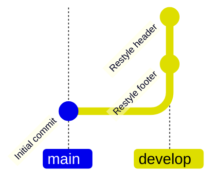


<!--
- what does squash do, exactly?
- "rewriting history"
- pretends your initial commits never happened
- creates a new commit containing all the changes from your previous commits.
-->

---
layout: center
---

## Force Push


```cmd
git push --force
```

<!--
- Because we're rewriting history
- scary warning when you try to push
- CMD: --force flag
- nothing to worry about
-->

---
layout: two-cols
---

### Local

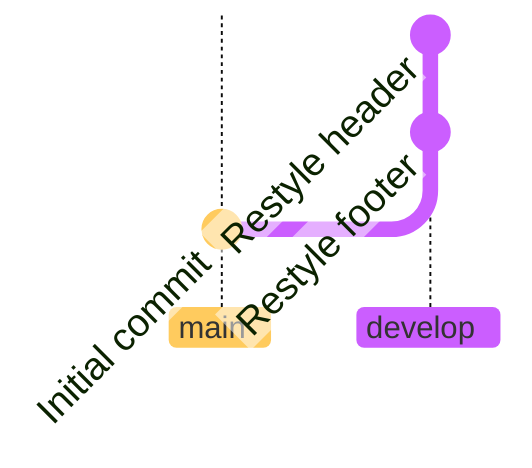

::right::
### Remote

<<< @/snippets/gitgraphs/pre-squash.mmd mermaid {scale: 0.75}

<!-- 
- Why `push --force`?
- changed the commits we've already pushed
- rewriting history

- Right
  - how remote thinks our branch looks
- Left:
  - how we think the branch looks on our local machine
  - after squashing
- Since the commits are different
- sure we want to overwrite what's on the server
- hence "forcing" that overwrite
- Wary of anybody else has been working on the same branch
  - you might overwrite their work too.
  - Best to avoid this
  - always check for new commits before you force push!
 -->

---
layout: image
image: /media/roselyn-tirado-GDWmu0bFfS4-unsplash.jpg
---

<!-- 
# DIY analogy

- Gets messy!
- 2 days work
- Stopping at end of day:
  - Quick tidy
  - wash paint brushes
- After complete:
  - Fully tidy
  - Before letting guests in the house!
- Treat branches the same
  - OK to be a bit messy while WIP
  - Tidy up before others work with it
  - nobody wants to see your messy branch!

 -->

---
layout: image-left
image: /media/slip.jpg
---

# <lucide-shield-alert /><br />Don't squash your mistakes
They tell a story

<small>
Image "Slip?" by Perry Hall on Flickr <a href="https://www.flickr.com/photos/freakingnoob/3438012333/">flickr.com/photos/freakingnoob</a>
</small>

<!--
 - Don't squash your mistakes!
 - Mistakes/reworkings tell a story
 - Valuable explanation to a future developer
 - documents your mistakes and learnings

 - Use amend/squash to tidy up
 - not to sweep under the rug!
 -->


---
layout: intro
---

# [5]{.number} Rebase ***and*** merge

The best of both worlds

<!--
Our final tip to keep these git repos tidy is to rebase AND merge.
-->
---


<<< @/snippets/gitgraphs/only-merge.mmd mermaid {scale: 0.8}

<!-- 
  Who's git graphs look like this?
-->

---
layout: center
---


<!-- GitHub provides these 3 options on completion of a Pull Request:

- Create a merge commit (which creates the mess you see above)
- Squash and merge
- Rebase and merge

 -->

---
layout: two-cols-header
---

## Squash and merge (with fast-forward)

::left::

<div class="view-transition-graph">
<<< @/snippets/gitgraphs/only-merge.mmd mermaid {scale: 0.7}
</div>

::right::

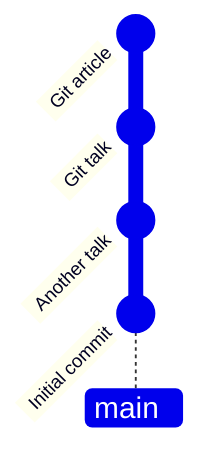

<!-- 
- some people like to squash and merge
- (or squash and rebase - it's the same thing)
- entire feature gets squashed into one commit
- plopped straight onto the develop or main branch
- very neat and tidy!
- you lose a lot of the documentation
  - when
  - how
  - and why code changes were made.
- Rather keep this history where we can
-->

---
layout: two-cols-header
---

## Rebase and merge

::left::

<div class="view-transition-graph">
<<< @/snippets/gitgraphs/only-merge.mmd mermaid {scale: 0.7}
</div>

::right::

<<< @/snippets/gitgraphs/rebase-and-merge.mmd mermaid {scale: 0.7}

<!--
- Leaves us with "Rebase and merge"
- Avoid losing data
- keeping the tree clean and tidy
- my favourite
- Azure DevOps = ["semi-linear merge"](https://devblogs.microsoft.com/devops/pull-requests-with-rebase/#semi-linear-merge)
-->

---

<div class="view-transition-graph">
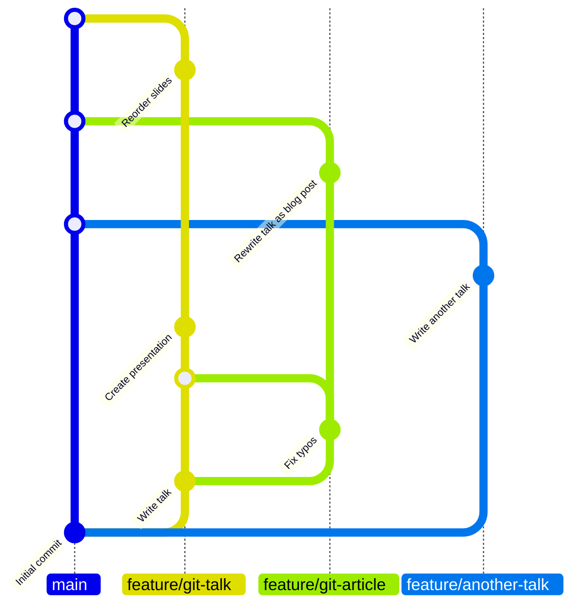
</div>

<!--
But wait, what's a rebase?

- Taken our messy commits
- time-travel to before we did the merge
- can walk through how we'd do this with rebase and merge.
-->

---

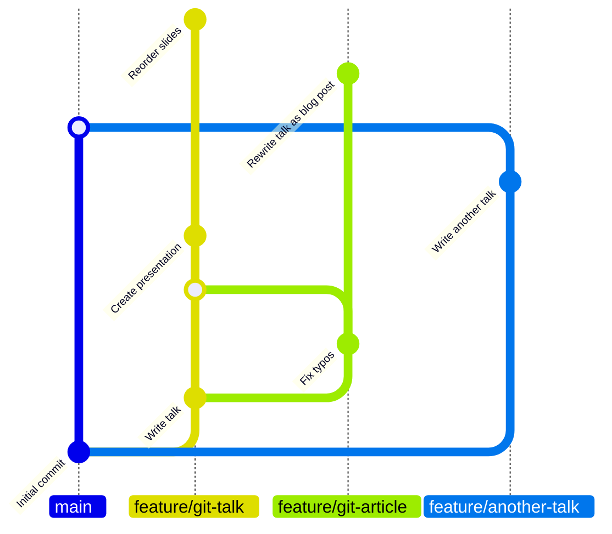

 <!--

 - Leave the merge of the `another-talk` - already cleanly merged into `main`
 - no intermediate commits to main
 - just the other two branches we need to worry about.
 
 -->

---

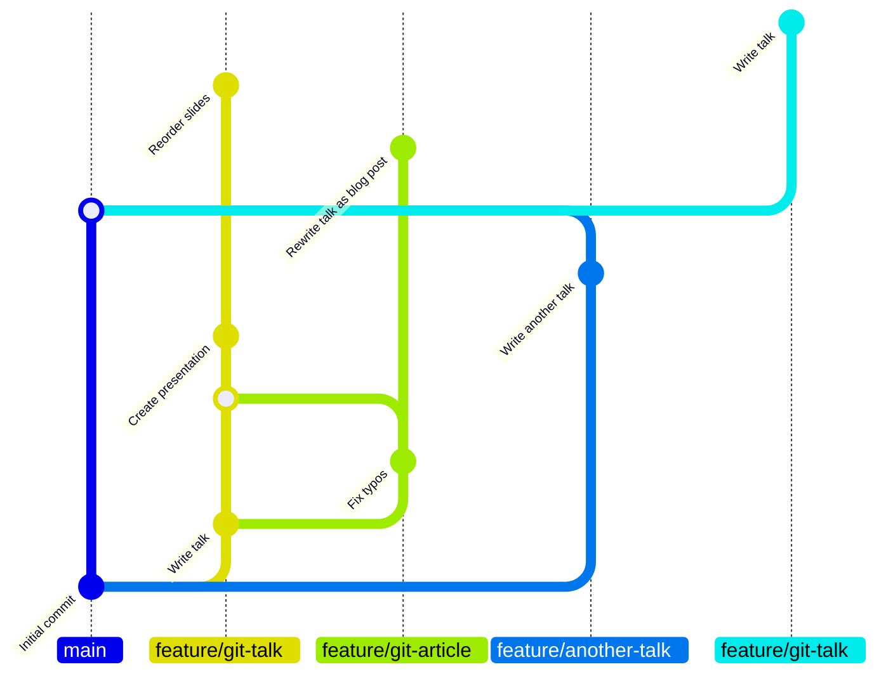

<!--

- created a new branch from the latest `main`
- cherry-pick to move a commit?
- extreme version of that!
- rebase = cherry-pick each commit
- add it to a new branch
- at later version of the same `main` branch
- Here I've "cherry-picked" the "Write talk" commit and put it onto our new branch.

-->

---

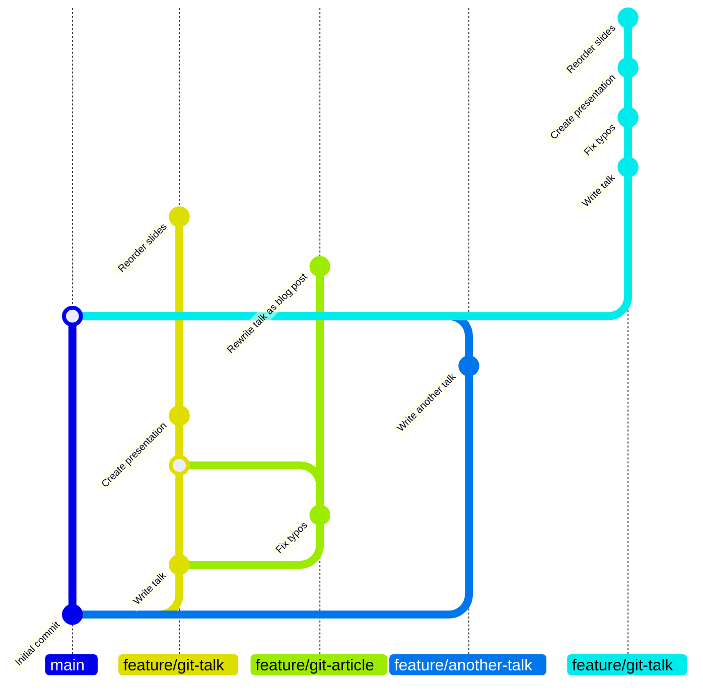

<!-- 

- repeat that for all commits needed
- including "fix typos" in that other branch
- fixing conflicts for each one
- That's rebasing!
- "cherry picked" each commit and resolved any conflicts
- more automated than cherry-picks

-->

---

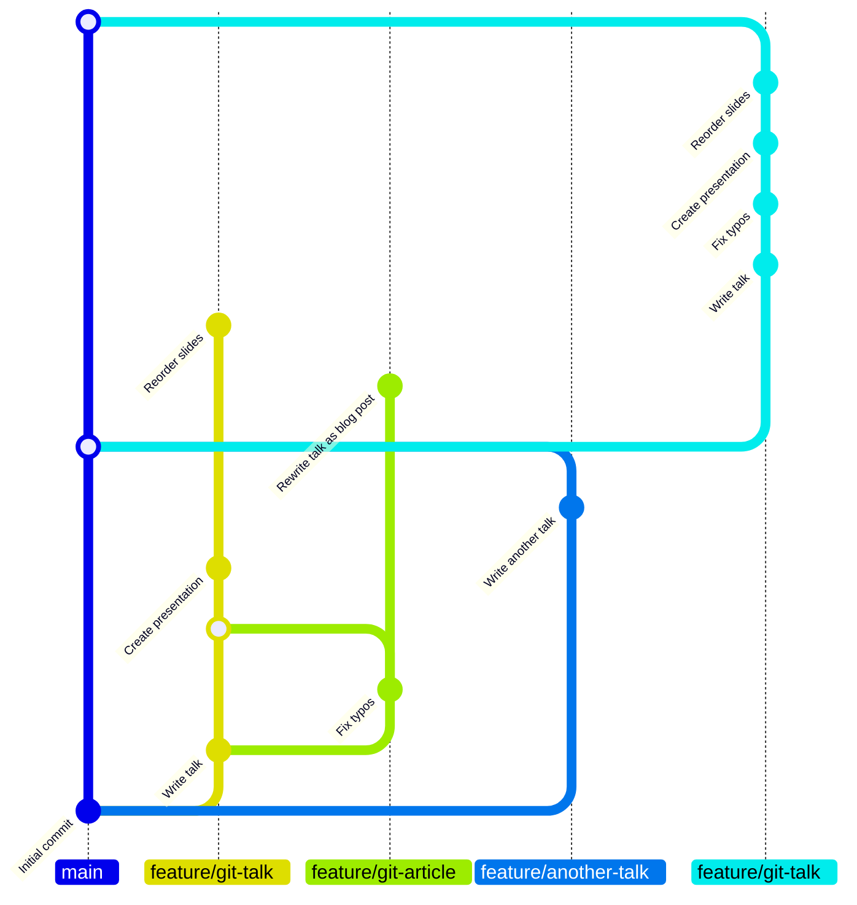

<!-- 
- Now we merge `git-talk` into `main`

-->

---

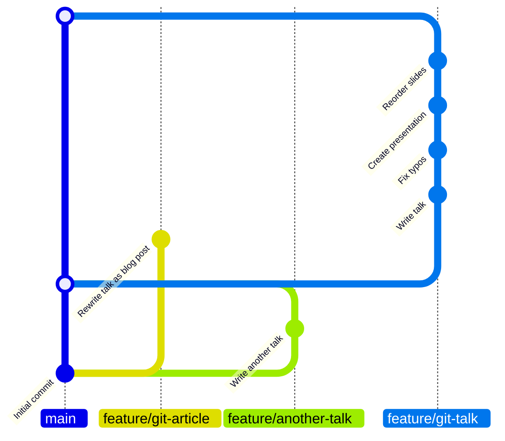

 <!--
 
- That old branch doesn't need to be there any more
- doesn't actually exist locally, so we can hide that.

- Then rebase and merge our final branch, `another-talk`.

-->

---

<div class="view-transition-graph">
<<< @/snippets/gitgraphs/rebase-and-merge.mmd mermaid {scale: 0.65}
</div>

<!-- To give us this! Each feature makes a neat "D" shape with the `main` or `develop` branch, with no crossovers. -->

---
layout: two-cols-header
---

## Rebase and merge

::left::

<<< @/snippets/gitgraphs/only-merge.mmd mermaid {scale: 0.7}

::right::

<div class="view-transition-graph">
<<< @/snippets/gitgraphs/rebase-and-merge.mmd mermaid {scale: 0.7}
</div>

<!-- 
- removes the muddle of criss-crossing merges
- maintaining
  - the whole branch structure
  - all the detail in every commit.
  
-->

---
layout: center
class: invert
---

1. #### **Rebase** ...and resolve any conflicts

  ```cmd
  git rebase main feature/git-article
  ```
  <br />

2. #### **Merge** in the feature/git-article branch

  ```cmd
  git switch main
  git merge feature/git-article
  ```
  <br />
  

3. #### **Delete** the unnecessary branch

```cmd
git branch -d feature/git-article
```

<!-- 
- Without GH
- individual tools: `rebase`,  `merge`
-->

---

# An awesome archive of software

<<< @/snippets/gitgraphs/rebase-and-merge.mmd mermaid {scale: 0.7}

<!--
- That's our stunning archive of software.
- Source controlled
- Small incremental commits
- meaningful and detailed commit message
- in feature branches
- no distracting noise and complicated merges.
- It reads easily from bottom to top
- No detail hidden or mistakes masked

-->

---
layout: image-left
class: invert
image: /media/brendan-stephens-Bl2tjfoBNv4-unsplash.jpg
---

# <lucide-shield-alert /><br />A note on **Rewriting history**

<small>
Photo by <a href="https://unsplash.com/@brendan_stephens?utm_content=creditCopyText&utm_medium=referral&utm_source=unsplash">Brendan Stephens</a> on <a href="https://unsplash.com/photos/black-and-white-labeled-book-Bl2tjfoBNv4?utm_content=creditCopyText&utm_medium=referral&utm_source=unsplash">Unsplash</a>
</small>

<!--

- My tips do something controversial: 
- rewriting history
-changing what's been pushed to the git repository (AKA history)
- after its happened (rewriting).
- Squashing, amending, rebasing and patching
- all examples of git history being rewritten
- And I've just been actively advocating for 3 of these!

-->

---
layout: two-cols
---

### True history

<div class="view-transition-graph">
<<< @/snippets/gitgraphs/only-merge.mmd mermaid {scale: 0.7}
</div>

::right::

### "Feature history"

<<< @/snippets/gitgraphs/rebase-and-merge.mmd mermaid {scale: 0.7}

<!--
- "true history" has merits:
  - useful for learning and code reviews
  - Risk of messing up your history
- Shouldn't at the cost of the readability of your repo
- "*feature* history"
  - order of our feature development is true
  - tweaking the timelines a little of when each feature was developed relative to each other
- Don't advocate for complete rewriting
- just a quick tidy up

-->
---
layout: image-left
image: /media/shocked-rich-cartoon.png
---

# <lucide-shield-alert /><br />Wait did you say **"risk"?!**

<small>
AI generated. Based on <a href="https://umbracocommunity.social/deck/@jacksorjacksor/112332950206455455">"Shocked man" by Richard Jackson</a>
</small>

<!--
 - "Risk" when rewriting history? [Click]
 - Make sure  _pushed_ your repository before messing with history.
 - Double check before your force push.

 -->
---
layout: intro
---

# <lucide-cloud-upload /> **Push** before you **rewrite.**
# <lucide-test-tube-diagonal /> **Check** before you **force push.**

<!--
 - "Risk" when rewriting history?
 - Make sure  _pushed_ your repository before messing with history.
 - Double check before your force push.

 -->
---
layout: icons-header
cols: 2
---

# Thank you

::icons::

- <logos-mastodon-icon /> [@joe@umbraco&#8239;community.social](https://umbracocommunity.social/joe)
- <logos-bluesky />  [@joe.gl](https://bsky.app/profile/joe.gl)
- <lucide-globe /> https://joe.gl/ombek
- <lucide-link /> https://joe.gl/ombek/links/git-about-best-practices/

::footer::

Git graphs generated with Mermaid, more about Mermaid: https://24days.in/umbraco-cms/2024/process-maps/

<!-- Thank you! -->