---
# You can also start simply with 'default'
theme: "slidev-theme-rockdove"
# random image from a curated Unsplash collection by Anthony
# like them? see https://unsplash.com/collections/94734566/slidev
# background: https://cover.sli.dev
# some information about your slides (markdown enabled)
title: Why am I being such a git about best practices?
info: |
  Are your git repos a dumping ground for code? I'm really fussy about how people use git - and that's a good thing. We'll take a look at branching strategies, the importance of commit messages and how often should you commit, anyway? Let's investigate how, with 5 simple tips, we can turn a code dump into a glorious archive of software and how this can save time, frustration and money.
# https://sli.dev/features/drawing
drawings:
  persist: false
# slide transition: https://sli.dev/guide/animations.html#slide-transitions
transition: view-transition
# enable MDC Syntax: https://sli.dev/features/mdc
mdc: true
# Icons: https://icon-sets.iconify.design/solar/?icon-filter=archive&suffixes=Bold+Duotone

layout: center
class: text-center
---

<style>
  .col-right {
    overflow: hidden;
  }

  .number {
    font-family: var(--font-family-code);
    background: var(--color-heading);
    color: var(--color-background);
    display: block;
    width: 1.2em;
    height: 1.2em;
    line-height: 1.2em;
    text-align: center;
    border-radius: 50%;
    font-size: 5rem;
  }

  small {
    color: var(--color-faint);
    font-size: 0.6em;
  }

  /* Colour the intro slides */
  :nth-child(7n + 1 of .slidev-page:has(.slidev-layout.intro)) {
    .slidev-layout {
      --color-background: var(--color-ming);
      --color-heading: var(--color-mandarin);
    }
  }
  :nth-child(7n + 2 of .slidev-page:has(.slidev-layout.intro)) {
    .slidev-layout {
      --color-background: var(--color-space-cadet);
      --color-heading: var(--color-mandarin);
    }
  }
  :nth-child(7n + 3 of .slidev-page:has(.slidev-layout.intro)) {
    .slidev-layout {
      --color-background: var(--color-mandarin);
      --color-heading: var(--color-space-cadet);
    }
  }
  :nth-child(7n + 4 of .slidev-page:has(.slidev-layout.intro)) {
    .slidev-layout {
      --color-background: var(--color-minion-yellow);
      --color-heading: var(--color-dark-blue-gray);
    }
  }
  :nth-child(7n + 5 of .slidev-page:has(.slidev-layout.intro)) {
    .slidev-layout {
      --color-background: var(--color-bud-green);
      --color-heading: var(--color-minion-yellow);
    }
  }
  :nth-child(7n + 6 of .slidev-page:has(.slidev-layout.intro)) {
    .slidev-layout {
      --color-background: var(--color-carolina-blue);
      --color-heading: var(--color-space-cadet);
    }
  }
  :nth-child(7n + 7 of .slidev-page:has(.slidev-layout.intro)) {
    .slidev-layout {
      --color-background: var(--color-dark-blue-gray);
      --color-heading: var(--color-minion-yellow);
    }
  }

  .mermaid {
    display: flex;
    justify-content: center;
  }
</style>

# Why am I being such a *git* about best practices?

---

## Joe Glombek

---

## What is **git**?
<!--
Let's start really simple: what is git? Git is the most popular Source Control Management (SCM) system. 
-->
---
layout: icons
---

- <solar-box-bold-duotone /> Backup
- <solar-archive-up-bold-duotone /> Versioning
- <solar-hand-stars-bold-duotone /> Sharability

<!--
It can ensure your code is backed up, versioned and accessible to other developers.
-->
---
layout: icons
---

- <solar-rocket-2-bold-duotone /> Release management
- <solar-star-fall-bold-duotone />Feature development
- <solar-recive-twice-square-bold-duotone /> Concurrent working

<!--
But used properly it can be so much more helping ease complex processes such as release management, feature development and multiple people working concurrently. But I can be a bit of a git about it: I'm really fussy about how people use git - and that's a good thing. I've worked with a fair few organisations and development teams over the years, and poor git utilisation is a more common issue than you might think. 
-->

---

TODO: dump vs library photos

<!--
But I can be a bit of a git about it: I'm really fussy about how people use git - and that's a good thing. I've worked with a fair few organisations and development teams over the years, and poor git utilisation is a more common issue than you might think. People use git as a dumping ground for code rather than an well-managed archive of software.
-->

---

# **5** simple tips to improve your git usage

<!-- Today we'll take a look at 5 simple tips which will, with any luck, improve your git practice. -->

---
layout: intro
---

# [0]{.number} Source **Control yourselves**

<!--
This isn't one of the 5, but there are seriously some organisations out there not using version control yet. Version control is _not_ the same as a backup and if you've emailed some code to a colleague, you're probably doing it wrong!
-->

---

<!-- <Tweet id="1432414619310739463" /> -->


🦋 @louella.dev
<!-- Why did the developer not want to use git? They were scared of committing to it! (Ba-dum tis!) For all the reasons I gave previously, version control is essential for modern day software development. -->

---
layout: icons
---

<ul>
  <li v-mark="{ at: 1, type: 'crossed-off', color: 'var(--color-mandarin)', strokeWidth: 10 }"><logos-mercurial /> Mercurial</li>
  <li v-mark="{ at: 1, type: 'crossed-off', color: 'var(--color-mandarin)', strokeWidth: 10  }"><logos-subversion /> Subversion</li>
  <li v-mark="{ at: 1, type: 'crossed-off', color: 'var(--color-mandarin)', strokeWidth: 10  }"><logos-visual-studio /> Team Foundation Version Control</li>
  <li v-mark="{ at: 1, type: 'circle', color: 'var(--color-bud-green)', strokeWidth: 10, padding: 20 }"><logos-git-icon /> Git</li>
</ul>

---
layout: intro
---

# [1]{.number} Commit **Messaging is everything**

<!-- Tip number 1: Commit Messaging is everything -->

---


https://xkcd.com/1296

<!-- Here's a comic from the brilliant XKCD. "As a project drags on, my git commit messages get less and less informative", going from something as descriptive as "created main loop and timing control" into the anarchy of "MY HANDS ARE TYPING WORDS" "HAAAAAANDS". I'd like to say that was just a joke in a comic strip... -->


---


https://x.com/dadolfi/status/1405424992121131010

<!-- ...but it can be all too real. I feel for you Dennis. -->

---
layout: two-cols
---

## Imagine being in Dennis' situation and...

- you've discovered a bug introduced in the latest version?
  Where do you even start to look for the solution?
- You see something odd in the codebase, there's no comment so you use a blame/annotate tool to see who changed it and why... but Andy is on holiday and his commit message says “test”
- Some piece of code has changed since you last saw it - why?
  You could revert it back to how you like it but maybe it was changed for a reason?
  You fire up the blame tool again, “Fixes date formatting issue in Chrome” - better leave it as it is!
  Saved by a good commit message!

::right::

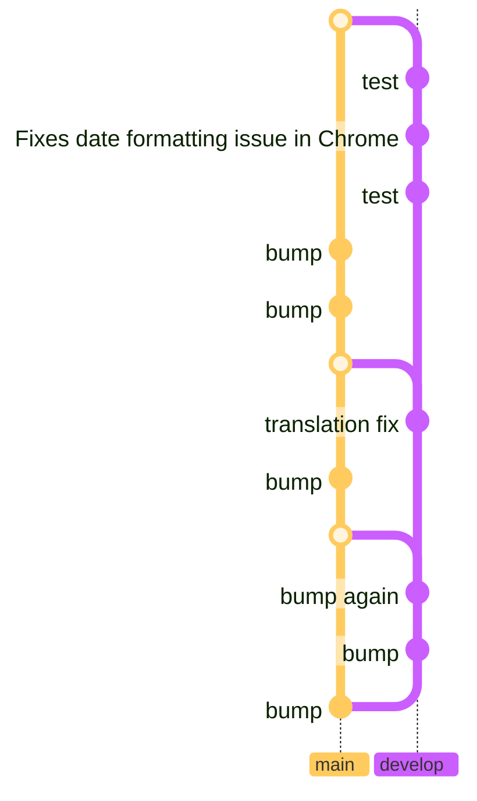

---
layout: icons-header
cols: 3
---

## "What does this commit do?"

::icons::

- <solar-adhesive-plaster-bold-duotone /> Fixes...
- <solar-undo-left-round-square-bold-duotone /> Reverts...
- <solar-plug-circle-bold-duotone /> Integrates...

---
layout: icons-header
cols: 3
---

## Not enough!

::icons::
<ul>
  <li v-mark="{ at: 1, type: 'crossed-off', color: 'var(--color-mandarin)', strokeWidth: 10 }"><solar-adhesive-plaster-bold-duotone /> Fixes bugs</li>
  <li v-mark="{ at: 1, type: 'crossed-off', color: 'var(--color-mandarin)', strokeWidth: 10 }"><solar-undo-left-round-square-bold-duotone /> Reverts broken changes</li>
  <li v-mark="{ at: 1, type: 'crossed-off', color: 'var(--color-mandarin)', strokeWidth: 10 }"><solar-plug-circle-bold-duotone /> Integrates API</li>
</ul>


<!-- But these alone are not enough. "Fixes bugs" or "Reverts broken changes" are still useless. -->

---
layout: icons-header
cols: 3
---


## "What does this commit do?"

::icons::

- <solar-adhesive-plaster-bold-duotone /> **Fixes date formatting issue in Chrome**
  Chrome always assumes the MM/DD format no matter what locale the browser is set to*
- <solar-undo-left-round-square-bold-duotone /> **Reverts new “Paytastic Checkout” checkout flow**
  Customer has changed their mind and wants to revert to using LegacyCart
- <solar-plug-circle-bold-duotone /> **Integrates SMS API**
  Sending an SMS to customers when their order ships using the “Simple SMS Sender” API

<small>* it doesn't, this is a made up example</small>

<!-- Detail, detail, detail! GitKraken (and many other GUI git clients) give you two fields for your commit messages - a title and a description. It's best to keep your title short (GitKraken recommends 72 characters) but you can add even more detail in the description field. Fixes date formatting issue in Chrome Chrome always assumes the MM/DD format no matter what locale the browser is set to* Reverts new "Paytastic Checkout" checkout flow Customer has changed their mind and wants to revert to using LegacyCart Integrates SMS API Sending an SMS to customers when their order ships using the "Simple SMS Sender" API  -->

---
layout: center
class: invert
---

```cmd
git commit -m "Title" -m "Description"
```


```
Title⏎
⏎
Description
```
<!-- Choice of git client isn't an excuse either - you can even do the on the command line by passing in two "message" parameters -->

---

## Link commits to issues

- Include the title of the issue/item
- Include an ID or link to the issue
  GitKraken lets you hook up your issue tracker to your git repos so you can automatically stick an issue number into the branch name (and therefore in the merge commit too!)

  <!-- TODO:Image -->

  <!-- If you have a ticketing system or to-do list, it sometimes helps to include the title of the item in your commit and an ID or link to the Initial issue can prove very useful. GitKraken (and many other GUI git clients) let you hook up your issue tracker to your git repos so you can automatically stick an issue number into the branch name (and it'll therefore be in the merge commit too!) -->

---
layout: intro
---

# [2]{.number} Push **Little and often**

---
layout: icons
---

- # <solar-ssd-square-bold-duotone />
- # <solar-jar-of-pills-2-bold-duotone />
- # <solar-bone-crack-bold-duotone />
- # <solar-bus-bold-duotone />

<!-- There's no point *only* committing when something is feature complete: what happens if your hard drive packs up overnight? Or you're off sick tomorrow and somebody else is left to pick up your work? It's far more useful to have partially complete work committed than not. Although it's generally good practice to ensure each commit is in a buildable state - it's ok if your work-in-progress (WIP) commits don't build. -->

---
layout: two-cols
---

## Reverting little things

You can also use your tiny commits to help you revert unwanted pieces of functionality, while it can be a real pain to pull small chunks of code out of a bigger commit.

Perhaps changing the colour-scheme to green text on a red background was a <i>bit</i> much...?

::right::

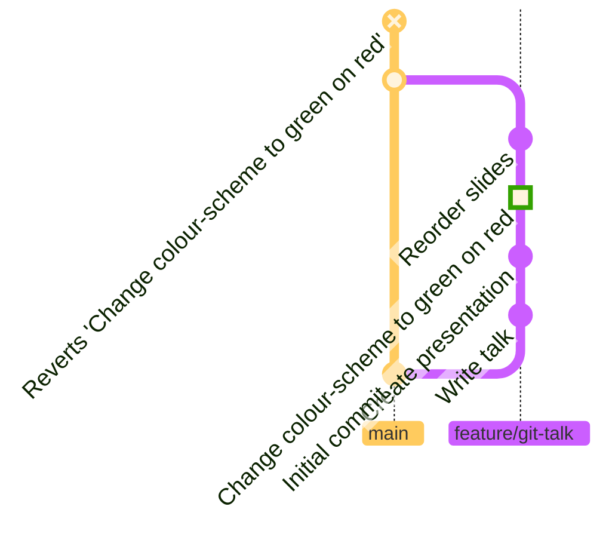

<!-- You can also use your tiny commits to help you revert unwanted pieces of functionality, while it can be a real pain to pull small chunks of code out of a bigger commit. Perhaps changing the colour-scheme to green text on a red background was a bit much...? -->

---
layout: intro
---

# [3]{.number} **Squash** rackets

<!-- But don't all these "little and often" commits start to make a _racket_ after a while? (See what I did there?) That's where squash and amend come in.  -->

---

## Amend commits

<v-clicks>

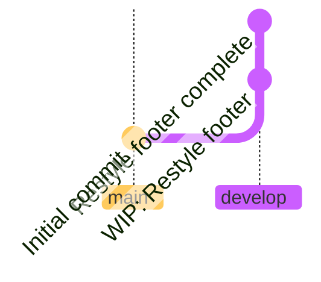

<!-- TODO: Amend screenshot -->

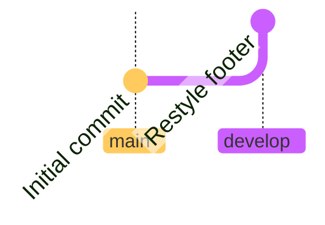

</v-clicks>

<!-- As I mentioned, I'm a big fan of a WIP (Work -In-Progress) commit at the end of the day. But, come tomorrow morning and I've finished that small segment of work off, I don't want two commits "WIP - Restyle footer" *and* "Restyle footer". So I can amend my "WIP" commit to include all changes and rename it to "Restyle footer". -->

---
layout: center
class: invert
---

```cmd
git commit --amend -m "Restyle footer"
```

https://atlassian.com/git/tutorials/rewriting-history

<!-- Or in the command line `git commit --amend -m "Restyle footer"`. Atlassian has a great tutorial about [rewriting git history from the command line](https://www.atlassian.com/git/tutorials/rewriting-history). -->

---

## Squash commits 

<v-clicks>

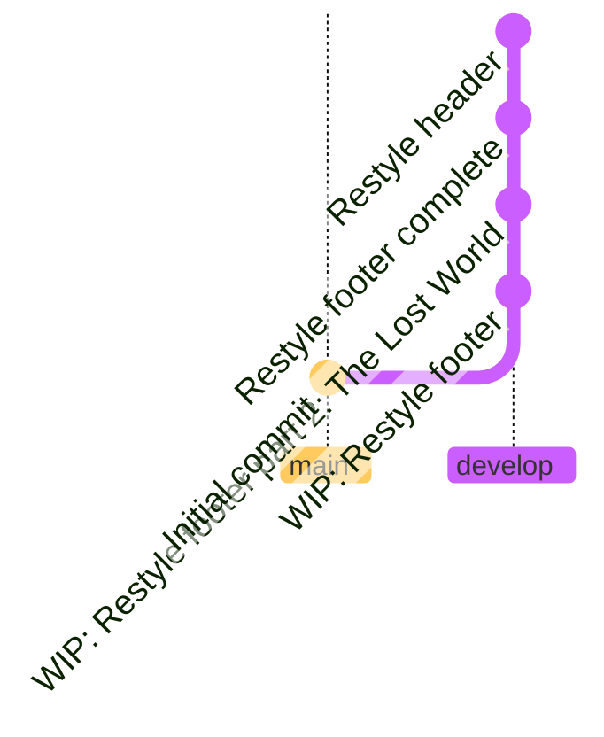

<!-- TODO: Squash screenshot -->

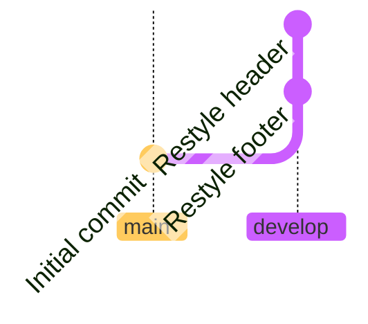

</v-clicks>

<!-- If you want to combine multiple commits, or you've already committed your second round of changes, you can look into "squashing" the commits. In GitKraken, this is done by selecting the multiple commits you want to combine, right clicking and selecting "Squash". There are some scenarios when squashing won't be available - in this case you might be best just leaving the history as-is! So what does squash do, exactly? Squash is a method of "rewriting history" in git. Essentially, it pretends your initial commits never happened, and creates a new commit containing all the changes from your previous commits. -->

---

## Force Push

TODO: Force push screenshots

```cmd
git push --force
```

---
layout: two-cols
---

### Local


::right::
### Remote


<!-- The reason we have to `push --force` is because we've changed the commits we've already pushed, rewriting history. On the left is how our remote thinks our branch looks, but on the right is how we think the branch looks on our local machine (after squashing). Since the commits are different, git want's us to be sure we want to overwrite what's on the server with what we have locally, hence "forcing" that overwrite. The only real thing to be wary of here is if anybody else has been working on the same branch, you might overwrite their work too. So it's best to avoid this (but also always check for new commits before you force push!) -->

---
layout: image
image: /media/roselyn-tirado-GDWmu0bFfS4-unsplash.jpg
---

<!-- If I'm doing some DIY at home, things can get pretty messy with tools and dirt around the place. Before I go to bed, I might do a quick tidy up but the next day, once I've finished the piece of work, all the tools go away and I vacuum up the mess I made. I'll definitely have it clean and tidy before I let anybody else in the house! Treat your branches the same way. It's OK for them to be a bit messy while you've got things in progress, but as soon as you're finished or ready to merge into a shared branch, you ought to tidy it up - nobody wants to see your messy branch! -->

---
layout: image-left
image: /media/slip.jpg
---

# <solar-shield-warning-bold-duotone /><br />Don't squash your mistakes
They tell a story

<small>
Image "Slip?" by Perry Hall on Flickr <a href="https://www.flickr.com/photos/freakingnoob/3438012333/">flickr.com/photos/freakingnoob</a>
</small>

<!-- One thing to note, though: don't squash your mistakes! Your mistakes and reworkings tell a story. It could provide valuable explanation to a future developer and documents your mistakes and learnings. Use amend and squash to tidy up, not to sweep under the rug! -->

---
layout: intro
---

# [4]{.number} Get with the **flow**

---
layout: icons-header
cols: 4
---


## Flows

::icons::

- <solar-branching-paths-up-bold-duotone /> Git Flow
- <logos-github-icon /> GitHub Flow
- <logos-gitlab /> GitLab Flow
- <solar-branching-paths-up-bold-duotone /> Common Flow

::footer::
https://go.joe.gl/which-flow

<!-- There are many branching strategies out there and I don't really mind which one you use. My personal favourites are GitHub flow and Common Flow (or a combination of the two) but there are many more. GitHub Flow and GitLab Flow aren't specific to their retrospective hosts either. Any flow can be used anywhere. Although a host may make it a bit easier to follow their flow on their host. -->

---
layout: icons-header
cols: 5
---

<style scoped>
  /* ul {
    font-size: 0.8em;
  } */
</style>

## GitFlow

::icons::

- <solar-branching-paths-up-bold-duotone />
  **Create a branch**
  with a short descriptive name
- <solar-menu-dots-square-bold-duotone />
  **Add commits**
  Each commit as an isolated, complete change
- <solar-question-square-bold-duotone />
  **Open a Pull Request**
  linked to an issue
- <solar-chat-square-code-bold-duotone />
  **Discuss and review**
  with the maintainer or a colleague
- <solar-minimize-square-minimalistic-bold-duotone />
  **Merge**
  and delete your branch

::footer::

https://go.joe.gl/ghflow

<!-- TODO: longer version should have CommonFlow too -->

<!--
GitHub flow, put very simply, involves creating a branch for your feature (with a short descriptive name), Adding your commits to that branch, each commit containing "an isolated, complete change" and then opening a Pull Request. You discuss and review your code changes with your colleagues. Once everyone is happy, your Pull Request is merged into the main branch. Main is always in a deployable state. The GitHub flow tutorial goes into a little more detail.

It's worth noting that if none of these git flows make sense to you, you can take inspiration from them. I don't know of many companies who strictly follow any one particular strategy. So pick one as a baseline and adapt it for your organisation. GitHub Flow and GitLab Flow don't have to be restricted to GitHub or GitLab - you can use any flow anywhere
-->

---
layout: intro
---

# [5]{.number} Rebase ***and*** merge

The best of both worlds

<!--
Our final tip to keep these git repos tidy is to rebase AND merge.
-->
---

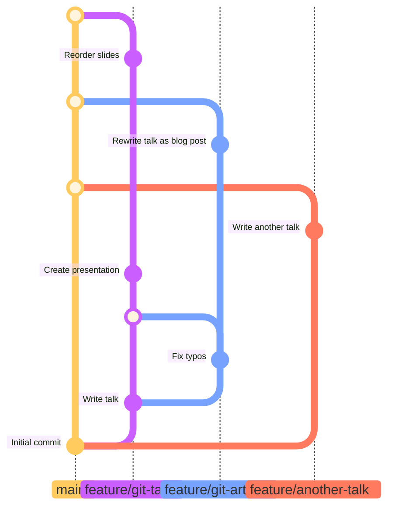

---

TODO: Rebase and merge screenshot

<!-- GitHub provides these 3 options on completion of a Pull Request: - Create a merge commit (which creates the mess you see above) - Squash and merge - Rebase and merge -->

---
layout: two-cols-header
---

## Squash and merge (with fast-forward)

::left::


::right::

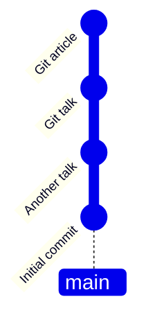

<!-- Now, some people like to squash and merge (or squash and rebase - it's the same thing): your entire feature gets squashed into one commit and plopped straight onto the develop or main branch. This is very neat and tidy, I'll give you that! However, you lose a lot of the documentation of when, how and why code changes were made. I'd much rather keep this history where we can. -->

---
layout: two-cols-header
---

## Rebase and merge

::left::

<div class="view-transition-graph">
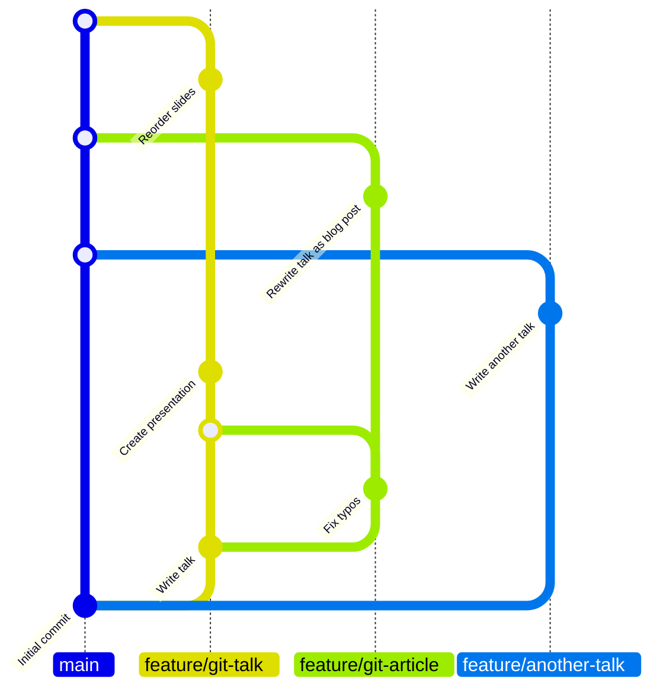
</div>

::right::

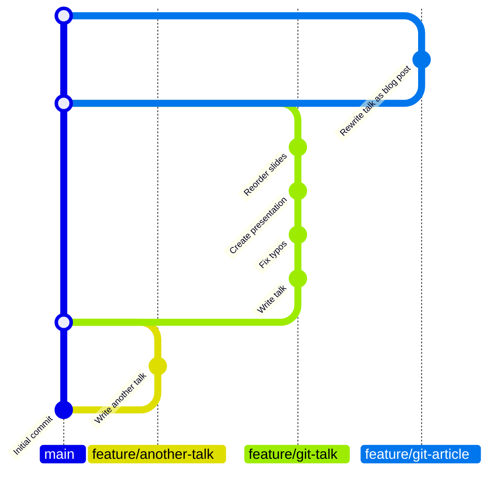

<!-- Which leaves us with "Rebase and merge". This option allows us to avoid losing data while keeping the tree clean and tidy so is, of course, my favourite. (If you're using Azure DevOps, you can set this method as the merge type too - they call it a ["semi-linear merge"](https://devblogs.microsoft.com/devops/pull-requests-with-rebase/#semi-linear-merge)).  -->

---

<div class="view-transition-graph">

</div>

---

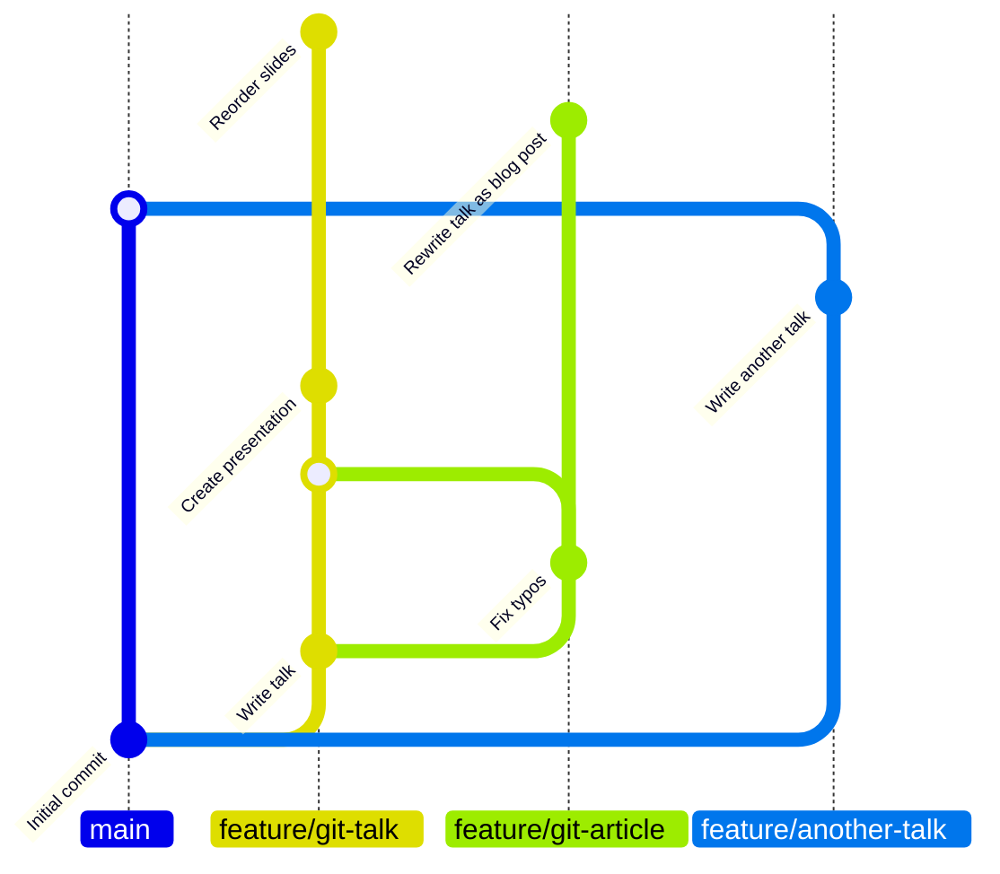

---

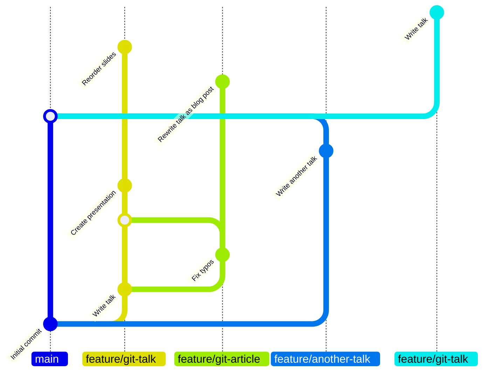

---

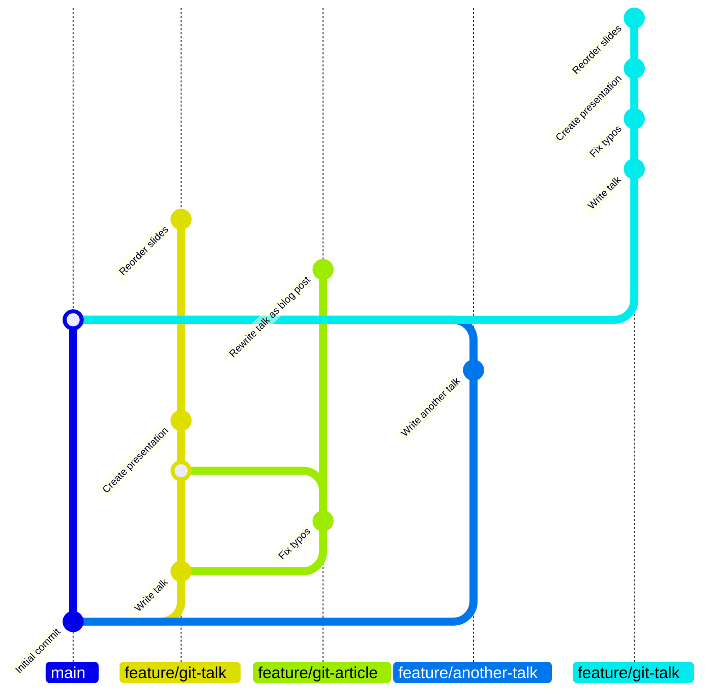

---

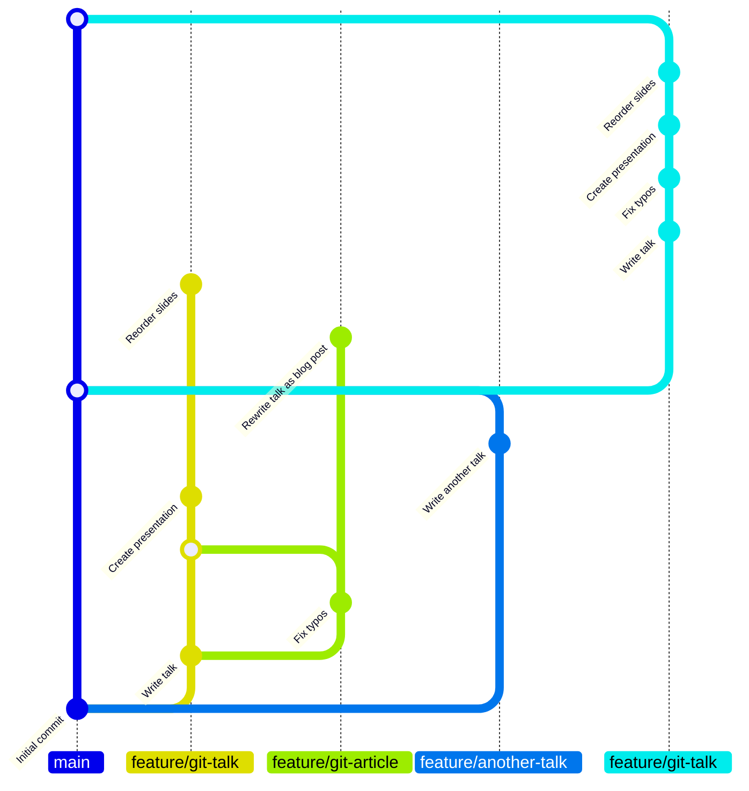

---

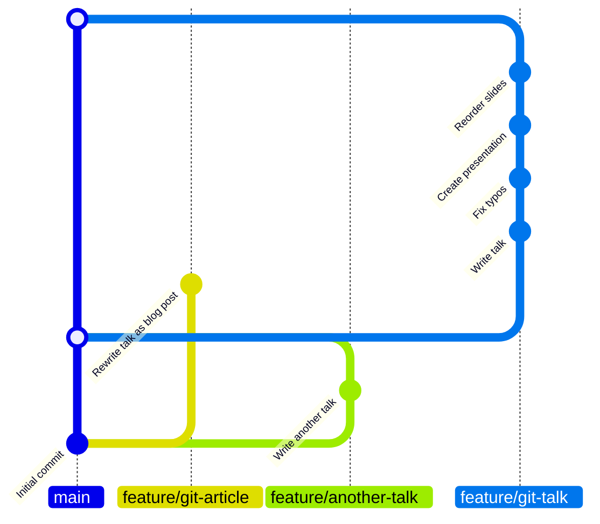

---

<div class="view-transition-graph">

</div>

---
layout: two-cols-header
---

## Rebase and merge

::left::

```mermaid {scale: 0.7}
gitGraph BT:
    commit id: "Initial commit"
    branch feature/git-talk
    commit id: "Write talk"
    branch feature/git-article
    commit id: "Fix typos"
    checkout feature/git-talk
    merge feature/git-article
    commit id: "Create presentation"
    checkout main
    branch feature/another-talk
    commit id: "Write another talk"
    checkout main
    merge feature/another-talk
    checkout feature/git-article
    commit id: "Rewrite talk as blog post"
    checkout main
    merge feature/git-article
    checkout feature/git-talk
    commit id: "Reorder slides"
    checkout main
    merge feature/git-talk
```

::right::

<div class="view-transition-graph">
```mermaid {scale: 0.7}
gitGraph BT:
    commit id: "Initial commit"
    branch feature/another-talk
    commit id: "Write another talk"
    checkout main
    merge feature/another-talk
    branch feature/git-talk
    commit id: "Write talk"
    commit id: "Fix typos"
    commit id: "Create presentation"
    commit id: "Reorder slides"
    checkout main
    merge feature/git-talk
    branch feature/git-article
    commit id: "Rewrite talk as blog post"
    checkout main
    merge feature/git-article
```
</div>

---

# Thank you

## Questions?

🐘 [@joe@umbraco&#8239;community.social](https://umbracocommunity.social/joe)

🦋 [@joe.gl](https://bsky.app/profile/joe.gl)


## Further Reading


<!-- Thank you! -->